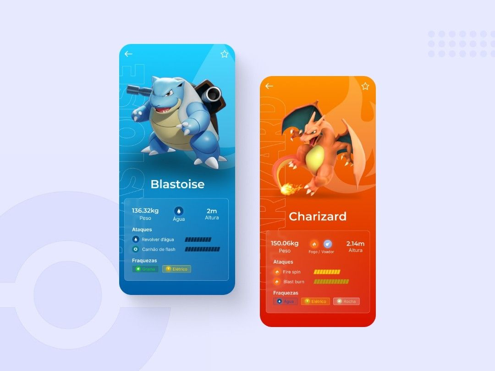

# ui_challenges

## Getting Started 🚀

A Very Good Project created by @TrindadeCode on linkedin.
That contains various UI Challenges, made with Flutter 💙

## Challange Table 🚀

| Folder name | Image |
| ------ | ------ |
| Settings UI | image here |
| Earbuds remote | image here |
| Delivery App |  |
| Pokemo App |  |
| Job App | image here, date: 08/09/2022  |

## Contributions

We love the open source flutter community!💙 If you'd like to contribute to one or all UI, feel free to open a pull-request at any time. To give new contributors exciting first challenges.

## Spread the word

Liked the project? Just give it a star ⭐️ and spread the word!

## Questions or Issues?

If something does not feel right or if you have questions, feel free to contact us. You can do so by [creating an issue](https://github.com/geekfabio/ui_challenges/issues)
